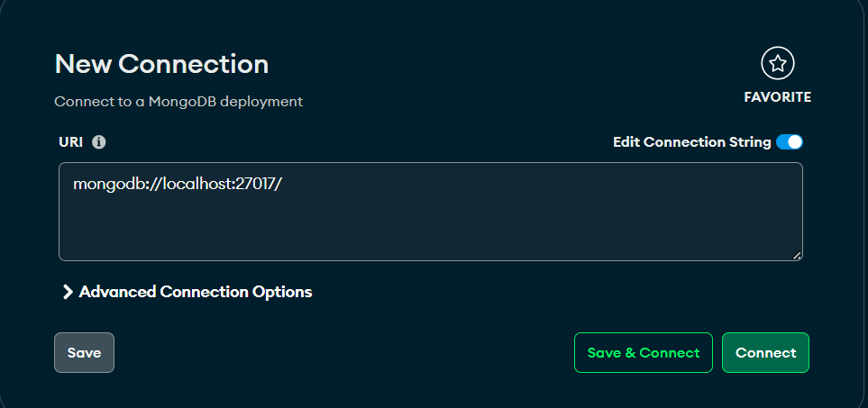
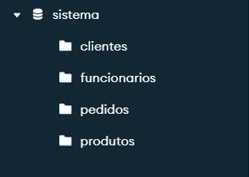

# Projeto CRUD Python

#### Abra MongoDB Compass

<p align="center">
  
</p>

- Conecte-se à ``` mongodb://localhost:27017/ ```
- Crie um banco de dados ``` sistema ``` e 4 colletions com os nomes ``` clientes ```, ```produtos```, ``` pedidos```, ``` funcionarios ```.

<p align="center">
  
</p>

#### Para iniciar o Projeto rode o comando:

```bash
python sistema.py
```
